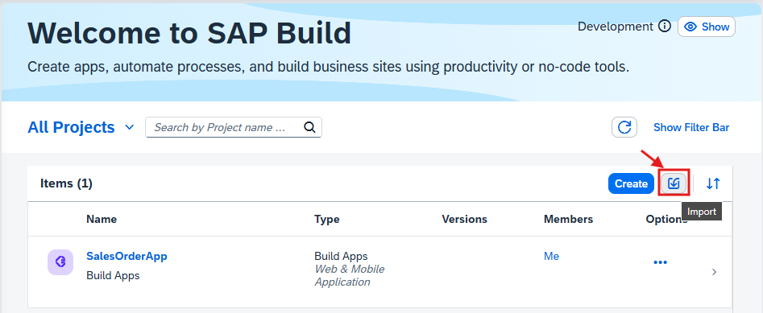
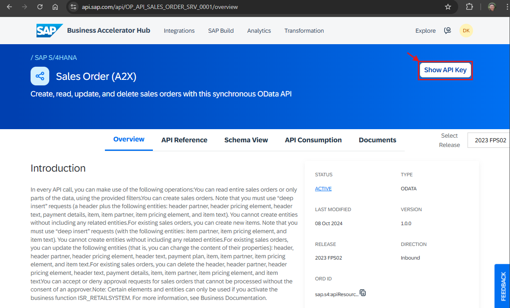
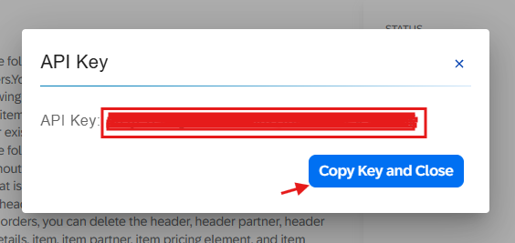
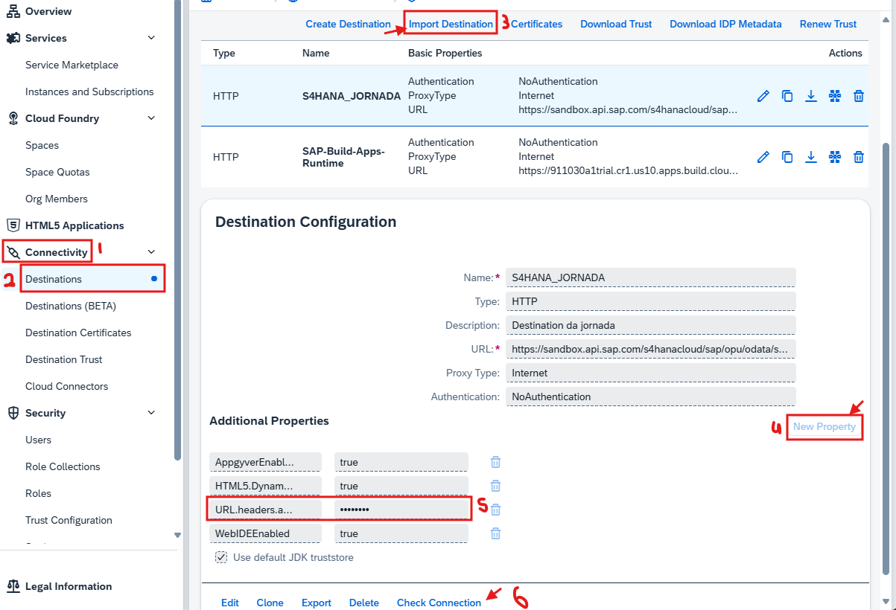
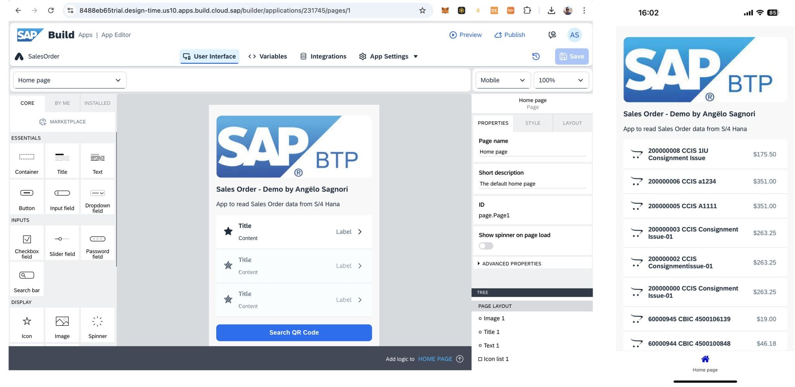
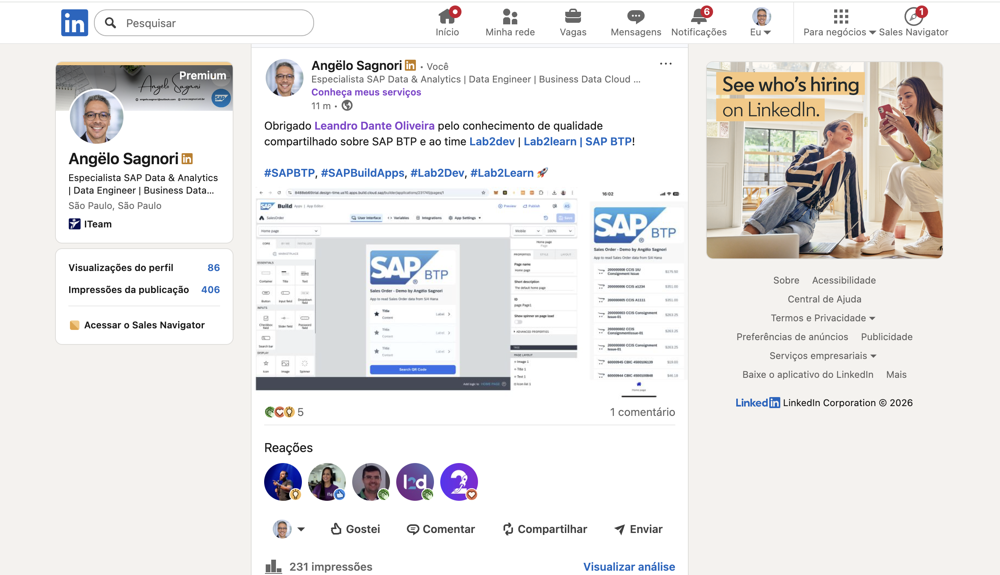

# PoC | S/4 HANA & SAP BTP Build App Sales Order 

Aplicação desenvolvida durante curso prático.

## Resources
- [SAP BTP trial account](https://cockpit.hanatrial.ondemand.com/trial/#/home/trial)
- [SAP Build Apps](https://www.sap.com/products/technology-platform/low-code-app-builder.html): 
- [SAP Build Apps Preview (Android & IOS app)](https://play.google.com/store/apps/details?id=com.sap.appgyver.preview.release&hl=pt_PT) | (https://apps.apple.com/us/app/sap-build-apps-preview/id1585856868).

## Purpose
- Listar ordens de venda.
- Exibir os detalhes em outra página.
- Scannear um QR Code de uma ordem de venda e exibir os detalhes.

## Import App into SAP Build Apps

Na pasta `mtar` deste repositório está o arquivo `mtar` do projeto desenvolvido.

## Get API Key

1. Acessar site da [api da SAP](https://api.sap.com/api/OP_API_SALES_ORDER_SRV_0001/overview)

2. Clicar no botão `Show API Key`

3. Selecionar a chave, copiar e fechar a janela (o botão não copia a chave).

## Set destination

Na pasta `destinations` deste repositório coloquei um arquivo que serve como template que pode ser baixado e importado.

1. Acessar subaccount, procurar menu `Connectivity`
2. Clicar em `Destinations`.
3. Clicar em botão `Import Destination` e selecionar arquivo template
4. Clicar em botão `New Property`
5. Adicionar chave `URL.headers.apikey` com o valor da API Key copiada do passo anterior

6. Testar a conexão (pode dar erro 401, mas funciona se a chave estiver correta)

## App Preview

1. Preview do App

2. Linkedin Post  ( -> [link](https://www.linkedin.com/posts/angelosagnori_sapbtp-sapbuildapps-lab2dev-activity-7294436045159383040-AvVg?utm_source=share&utm_medium=member_desktop&rcm=ACoAAAL20AUBms5unlanoxqks6M_s6LN3KpE4lA))

 

# Créditos

# Contato

